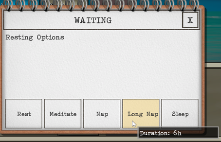

# Long Nap
  
Adds a new option called "Long Nap" which is a six hour nap.

It has the same benefits as if the character was able to take 1.5 naps.


# Languages
The game will automatically pick up the player's language.

Translations can be changed in the localization files located in the ./lang folder.

|Language|File Name|
|--|--|
|English|./lang/en.csv|
|Chinese|./lang/zh.csv|

## Additional Languages
If there is a new language added to the game, the mod will attempted to load translations from a file named ```./lang/{Game's Langauge Name}.csv```.
Translations can be added to that file.

A warning will be added to the ```.\BepInEx\LogOutput.log``` indicating the fallback translation file name.


# Change Log
# 1.0.0

Release
